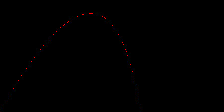

# Ray Tracer
_Jamis Buck's ray tracer challenge in TS_

Simple generally test-first TS project to get a feel for Typescript.

## What's done
- Simple mathematical `Tuple` implemntation
- `Canvas` & `Colour` implementations
- PPM image serialization of a `Canvas`
- Chapter 2's projectile rendering challenge

## Screenshots

Projectile renderer output example (converted from PPN to JPG for GH):

